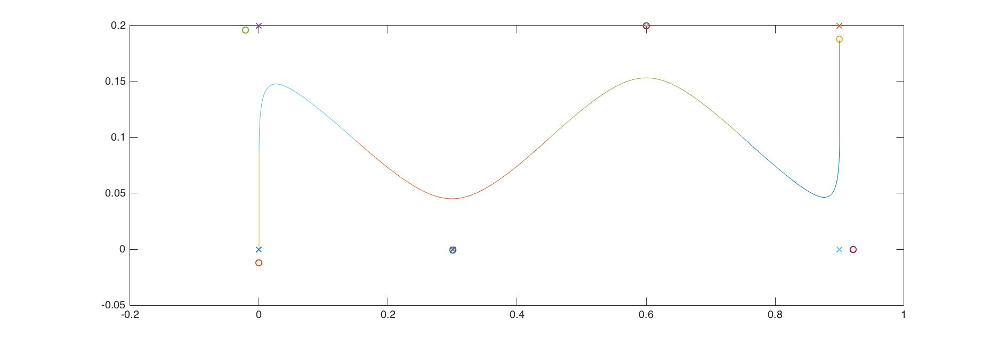

# Linear Inverted Pendulumn Model for Humanoid Robots

## Introduction
The programs of this repository realizes the algorithm proposed by Kajita in his book *Introduction to Humanoid Robotics*.

The basic idea is to model a humanoid robot with a single mass point plus two weightless rods, that swing in certain pattern under the reaction of gravity and with an initial velocity. With this model, we are able to derive a beautiful expression for controlling the center of mass trajectory for the robot. The model has proven feasible and robust in practice.

Details of the algorithm can be found in the book, Chapter 3 and Chapter 4. A Chinese version of .pdf file is also uploaded to this repository, illustrating all the necessary details in the course of realizing this algorithm with MATLAB code. For English version of description of this project, see [my website](http://aray.pub/categories/Projects/Humanoid/).

## Code Architecture
The project is organized as follows:

* **TotalMass.m** is used to recurvisely calculate the total mass of the robot.
* **Forwardkinematics.m** calculates the final position of all joints with the information of joint angles.
* **LIP.m** is the raw program for LIP modeling, which is written for general purpose, but can *not* be run directly. To actually run the model, we need to call either **straightline.m** or **turn.m**.
* **straightline.m** is for the robot to walk straightline (can be a sidewalk) and **turn.m** is programmed for where the robot needs to change its direction during walking.

Note that we use slightly different algorithms for the robot to turn. Also note that when using this program, we need to change the filename such that the name of the file matches the name of the function inside. Right now, all function names are LIP.

## Usage
The basic usage for the programs are as follows. First in MATLAB's command line environment, type

	>> sx = [0.0, 0.3, 0.3, 0.3, 0];
	>> sy = [0.2, 0.2, 0.2, 0.2, 0.2];
These commands are general configurations of where the robot's feet are supposed to be. Then we call the LIP program by

	>> LIP(0.8, 0.8, sx, sy, 0, 0, 0, 0, 0, 0, 10, 1);
	
This will run the program and plot a figure like this:

The colored curve indicates the trajectory of the robot's CoM, while the points on the figure are desired foot position / actual foot position.

For more detailed instruction, see the .pdf file in this repository. For English version of description of this project, see [my website](http://aray.pub/categories/Projects/Humanoid/).